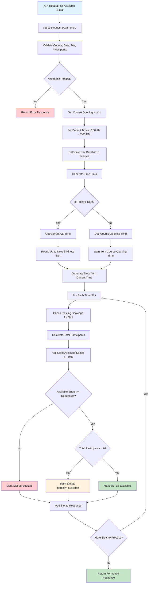
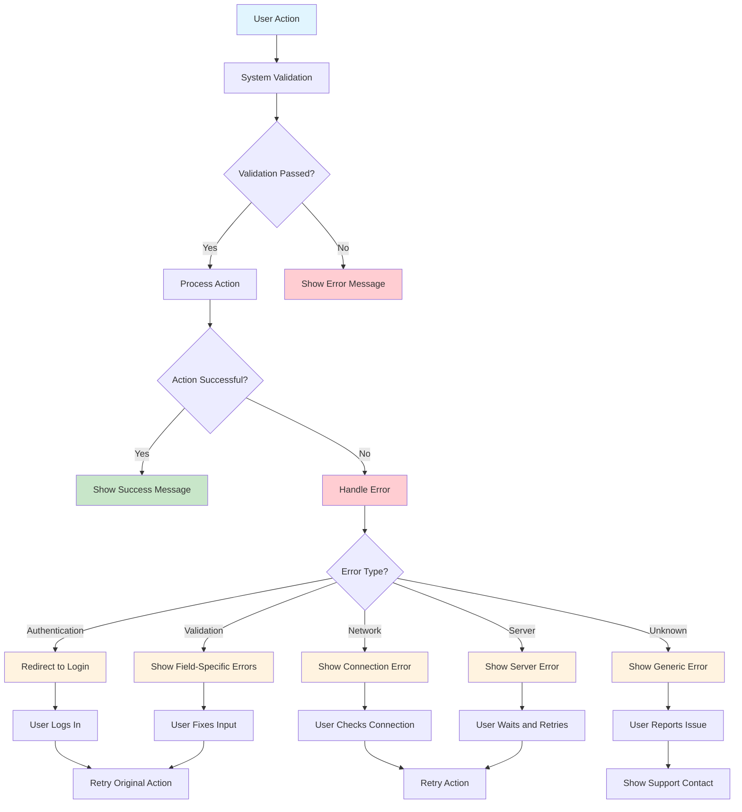

# Tee-Booking Flow Chart

## Complete Tee-Booking Flow

```mermaid
flowchart TD
    A[User Navigates to Tee-Booking Page] --> B[TeeBookingComponent Initializes]
    B --> C[Load Course Data from Route]
    C --> D[Fetch Available Tees for Course]
    D --> E[Generate Calendar Interface]
    
    E --> F[User Selects Tee]
    F --> G[selectTee() Method Called]
    G --> H[Store Tee Selection]
    H --> I[Load Previous Selections for Tee/Date]
    I --> J[Update Slot Summary]
    
    E --> K[User Selects Date]
    K --> L[selectDate() Method Called]
    L --> M[Validate Date Range]
    M --> N[Store Date Selection]
    N --> O[Restore Previous Selections for Date]
    O --> P[Load Time Slots if Ready]
    
    E --> Q[User Sets Participant Count]
    Q --> R[incrementParticipants() / decrementParticipants()]
    R --> S[Update Participant Count]
    S --> T[Reload Time Slots with New Count]
    
    P --> U[API Call to /booking/available_slots/]
    T --> U
    U --> V[Backend Generates Time Slots]
    V --> W[Filter Past Slots for Today]
    W --> X[Calculate Availability Based on Existing Bookings]
    X --> Y[Return Available Slots]
    
    Y --> Z[Frontend Processes Slots]
    Z --> AA[Display Available Time Slots]
    
    AA --> BB[User Clicks on Time Slot]
    BB --> CC[openSlotModal() Called]
    CC --> DD[Slot Modal Opens]
    DD --> EE[Show Available Spots & Participant Selector]
    
    EE --> FF[User Confirms Slot Selection]
    FF --> GG[confirmSlotSelection() Processes]
    GG --> HH{Is Multi-Slot Mode?}
    
    HH -->|Yes| II[Add to Multi-Slot Selection]
    HH -->|No| JJ[Single Slot Selection]
    
    II --> KK[Update selectedSlots Array]
    JJ --> KK
    KK --> LL[Update Date-Based Selections]
    LL --> MM[Update Slot Summary]
    MM --> NN[Close Modal]
    
    NN --> OO[User Can Select More Slots]
    OO --> BB
    
    OO --> PP[User Clicks 'Book Tee Time']
    PP --> QQ[bookTeeTime() Method Called]
    QQ --> RR[Validate All Selections]
    
    RR --> SS{Validation Passed?}
    SS -->|No| TT[Show Error Message]
    SS -->|Yes| UU[Check Booking Type]
    
    UU --> VV{Single or Multi-Slot?}
    VV -->|Single| WW[createSingleBooking()]
    VV -->|Multi| XX[createMultiBookings()]
    
    WW --> YY[API Call to POST /booking/]
    XX --> ZZ[API Call to POST /booking/create_multi_slot_booking/]
    
    YY --> AAA[Backend Processes Booking]
    ZZ --> AAA
    
    AAA --> BBB[Validate Member Authentication]
    BBB --> CCC[Create Main Booking Record]
    CCC --> DDD[For Multi-Slot: Create Individual Slot Records]
    DDD --> EEE[Generate Unique Booking ID]
    EEE --> FFF[Return Success Response]
    
    FFF --> GGG[Frontend Receives Response]
    GGG --> HHH[Show Booking Confirmation Modal]
    HHH --> III[Display Booking Details]
    
    III --> JJJ[Booking Appears in Orders Component]
    JJJ --> KKK[User Can View, Cancel, or Modify Booking]
    
    style A fill:#e1f5fe
    style KKK fill:#c8e6c9
    style TT fill:#ffcdd2
    style FFF fill:#c8e6c9
```

## Detailed Slot Selection Flow

```mermaid
flowchart TD
    A[User Clicks Time Slot] --> B[openSlotModal()]
    B --> C[Check if Slot Already Selected]
    
    C -->|Yes| D[Load Existing Slot Data]
    C -->|No| E[Prepare New Slot Data]
    
    D --> F[Show Modal with Current Participant Count]
    E --> G[Show Modal with Default Participant Count]
    
    F --> H[User Modifies Participant Count]
    G --> H
    
    H --> I[User Confirms Selection]
    I --> J[confirmSlotSelection()]
    
    J --> K{Is Existing Slot?}
    K -->|Yes| L[Update Existing Slot]
    K -->|No| M[Create New Slot]
    
    L --> N[Find Slot in selectedSlots]
    N --> O[Update Participant Count]
    O --> P[Update currentTimeSlots Display]
    
    M --> Q[Create Slot Copy]
    Q --> R[Set Participant Count]
    R --> S[Set Date and Tee Information]
    S --> T[Add to selectedSlots Array]
    T --> U[Update currentTimeSlots Display]
    
    P --> V[Update Date-Based Selections]
    U --> V
    
    V --> W[Update Slot Summary]
    W --> X[Close Modal]
    X --> Y[Slot Now Selected and Visible]
    
    style A fill:#e1f5fe
    style Y fill:#c8e6c9
    style L fill:#fff3e0
    style M fill:#fff3e0
```

## Backend Slot Generation Flow



## Multi-Slot Booking Creation Flow

```mermaid
flowchart TD
    A[User Submits Multi-Slot Booking] --> B[bookTeeTime() Called]
    B --> C[Validate All Selected Slots]
    
    C --> D{Validation Passed?}
    D -->|No| E[Show Error Message]
    D -->|Yes| F[Prepare Slots Data]
    
    F --> G[Map Selected Slots to API Format]
    G --> H[Include Course, Tee, Date, Time, Participants]
    H --> I[API Call to create_multi_slot_booking]
    
    I --> J[Backend Receives Request]
    J --> K[Validate Member Authentication]
    K --> L[Parse Slots Data]
    
    L --> M[Create Main Booking Record]
    M --> N[Set has_multiple_slots = true]
    N --> O[Generate Unique Booking ID]
    
    O --> P[Process Each Slot]
    P --> Q[Validate Slot Data]
    Q --> R[Get Tee Instance]
    R --> S[Create BookingSlotModel Record]
    
    S --> T[Link Slot to Main Booking]
    T --> U[Set Slot Order and Status]
    U --> V[Calculate Total Participants]
    
    V --> W{More Slots to Process?}
    W -->|Yes| P
    W -->|No| X[Update Main Booking with Totals]
    
    X --> Y[Save All Records to Database]
    Y --> Z[Return Success Response]
    
    Z --> AA[Frontend Receives Confirmation]
    AA --> BB[Show Booking Success Modal]
    BB --> CC[Display Booking ID and Details]
    CC --> DD[Update Orders Component]
    
    style A fill:#e1f5fe
    style DD fill:#c8e6c9
    style E fill:#ffcdd2
    style Y fill:#c8e6c9
```

## Join Request Flow

```mermaid
flowchart TD
    A[User Selects Partially Available Slot] --> B[Check if Slot Has Existing Bookings]
    B --> C{Slot Has Bookings?}
    
    C -->|No| D[Regular Booking Process]
    C -->|Yes| E[Join Request Process]
    
    E --> F[Set is_join_request = true]
    F --> G[Find Original Booking]
    G --> H[Set original_booking Reference]
    H --> I[Set Status to 'pending_approval']
    
    I --> J[Submit Join Request via API]
    J --> K[Backend Creates Join Request]
    K --> L[Send Notification to Original Booker]
    
    L --> M[Original Booker Receives Notification]
    M --> N[Original Booker Reviews Request]
    
    N --> O{Approve or Reject?}
    O -->|Approve| P[approve_join_request()]
    O -->|Reject| Q[reject_join_request()]
    
    P --> R[Check if Slot Can Accommodate]
    R --> S{Enough Space?}
    S -->|No| T[Return Error: Slot Full]
    S -->|Yes| U[Update Join Request Status to 'approved']
    
    U --> V[Generate New Booking ID for Join Request]
    V --> W[Send Approval Notification to Joining Member]
    W --> X[Join Request Now Active]
    
    Q --> Y[Update Join Request Status to 'rejected']
    Y --> Z[Send Rejection Notification to Joining Member]
    Z --> AA[Join Request Closed]
    
    style A fill:#e1f5fe
    style X fill:#c8e6c9
    style AA fill:#ffcdd2
    style T fill:#ffcdd2
    style U fill:#c8e6c9
    style Y fill:#ffcdd2
```

## Error Handling Flow



## State Management Flow

```mermaid
flowchart TD
    A[Component Initialization] --> B[Initialize State Variables]
    B --> C[Load Course and Tee Data]
    C --> D[Generate Calendar]
    
    D --> E[User Interactions]
    E --> F[State Changes]
    
    F --> G{State Type?}
    G -->|Tee Selection| H[updateTeeState()]
    G -->|Date Selection| I[updateDateState()]
    G -->|Slot Selection| J[updateSlotState()]
    G -->|Participant Change| K[updateParticipantState()]
    
    H --> L[Update selectedTee]
    L --> M[Load Previous Selections for Tee]
    M --> N[Update currentTimeSlots]
    
    I --> O[Update selectedDate]
    O --> P[Restore Previous Selections for Date]
    P --> Q[Load Time Slots if Ready]
    
    J --> R[Update selectedSlots Array]
    R --> S[Update dateSlotSelections Map]
    S --> T[Update Slot Summary]
    
    K --> U[Update participantCount]
    U --> V[Reload Time Slots]
    V --> W[Update Slot Availability]
    
    N --> X[Trigger Change Detection]
    Q --> X
    T --> X
    W --> X
    
    X --> Y[Update UI Display]
    Y --> Z[User Sees Updated State]
    
    Z --> E
    
    style A fill:#e1f5fe
    style Z fill:#c8e6c9
    style X fill:#fff3e0
    style E fill:#e3f2fd
```
